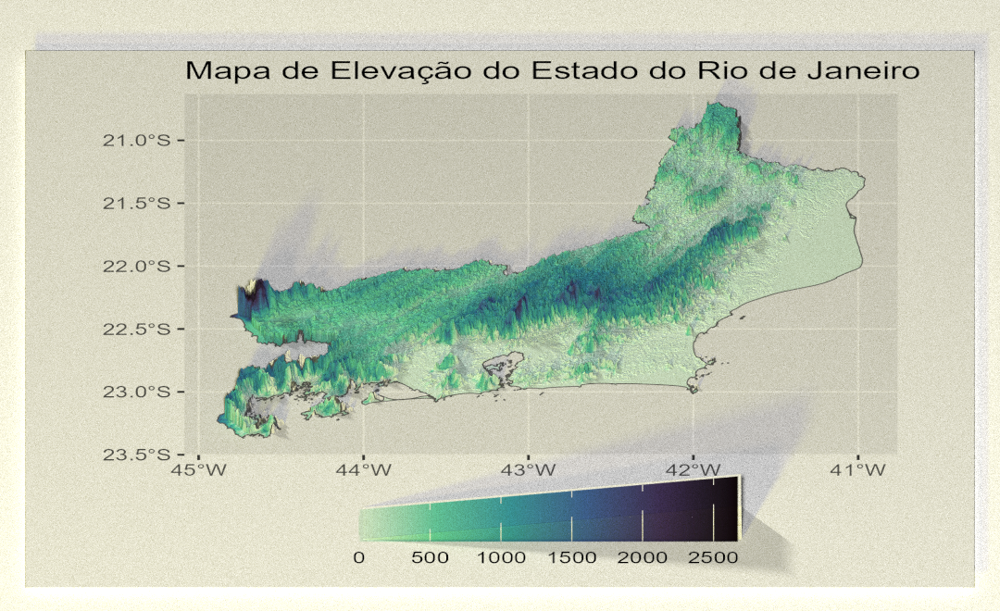

## Mapa 3D de Elevação do Rio de Janeiro com Rayshader e ggplot2

Este repositório contém os scripts utilizados para a confecção de um mapa de elevação com a biblioteca rayshader e outro mapa em que utilizamos a biblioteca `ggplot2` em associação com `rayshader`.

A principal diferença entre ambos os mapas é que o mapa confeccionado com `ggplot2` em associação com `rayshader` possui legenda de cor e as coordenadas x e y incluídas na visualização. Apresentando um caráter mais técnico, enquanto o mapa sem `ggplot2` é de caráter artístico.

## Sobre o pacote Rayshader:

Rayshader é um pacote de código aberto voltado para a produção visual 2D e 3D de dados no R desenvolvido por [Tyler Morganwall](https://github.com/tylermorganwall). O pacote utiliza dados de elevação em uma matriz base R e uma combinação de *raytracing*, algoritmos de sombreamento e sobreposições para gerar mapas. Para saber mais sobre o pacote é possível acessar seu [site oficial](https://www.rayshader.com/).

## Reprodução:

Os arquivos raster foram obtidos manualmente a partir do site [Earth Explorer - USGS](https://earthexplorer.usgs.gov/) e os arquivos shapefile foram obtidos manualmente no site do [IBGE](https://www.ibge.gov.br/geociencias/organizacao-do-territorio/malhas-territoriais/15774-malhas.html). Após o download, eles foram extraídos e armazenados em uma pasta intitulada "dados" no diretório do projeto.

Os scripts `Rayshader_RJ_Relevo.R` e `Anotacoes_RJ_Relevo.R` correspondem a duas etapas de confecção do mapa de relevo do RJ sem a biblioteca `ggplot2`. Para verificar o script utilizado para confecção do mapa com `ggplot2` acesse a pasta `Rayggplot_RJ`.
